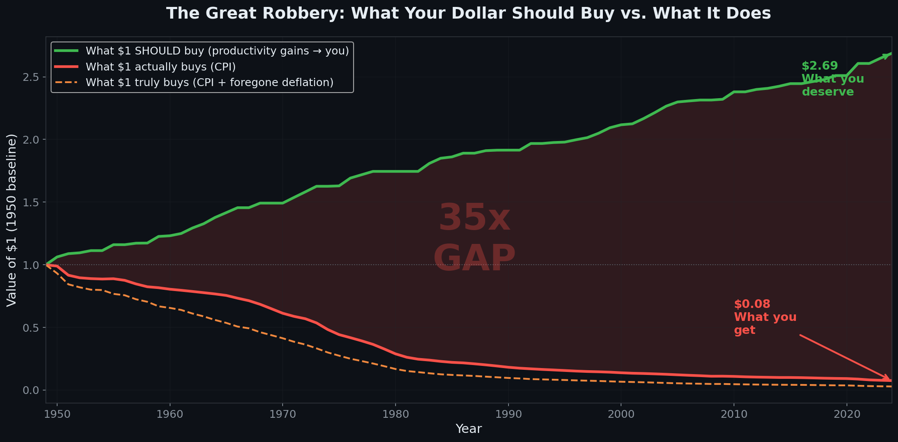
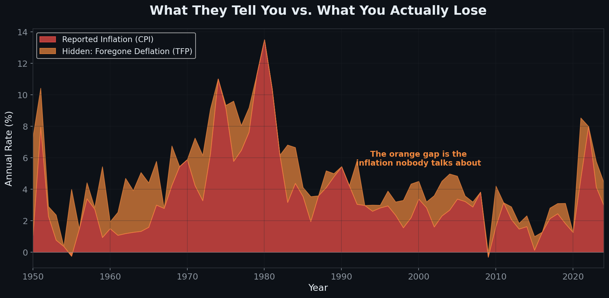
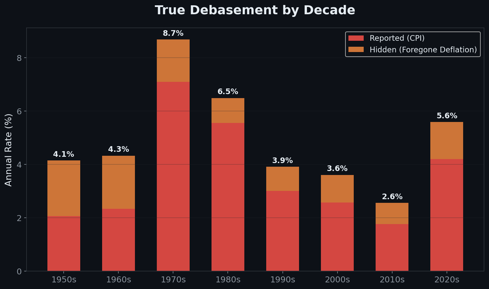
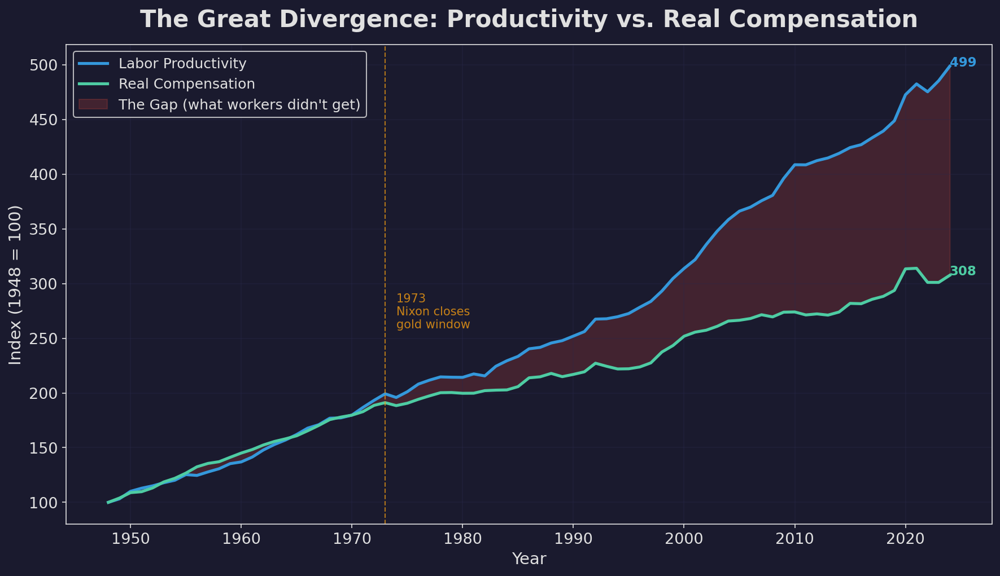
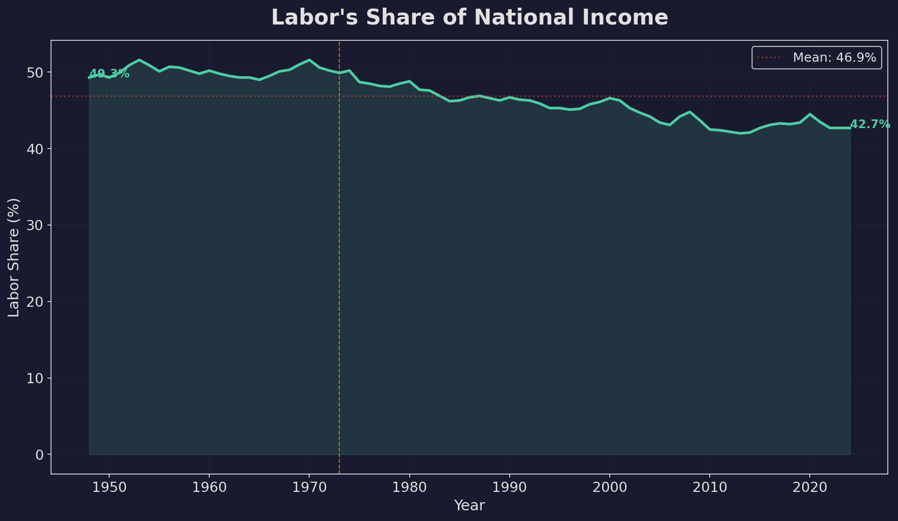
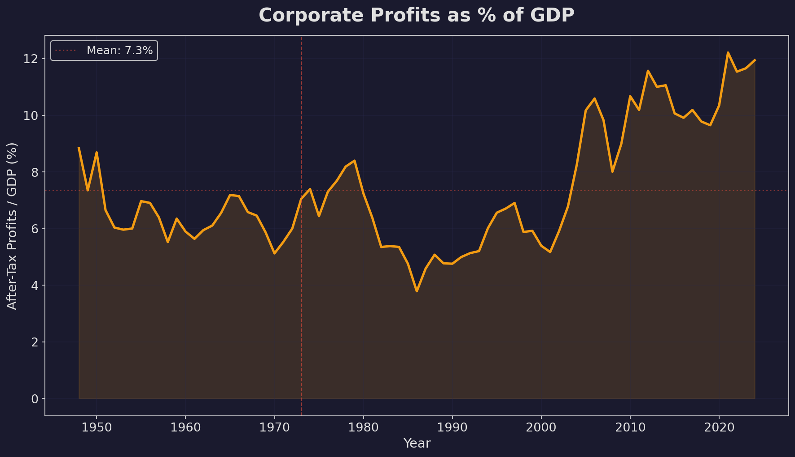
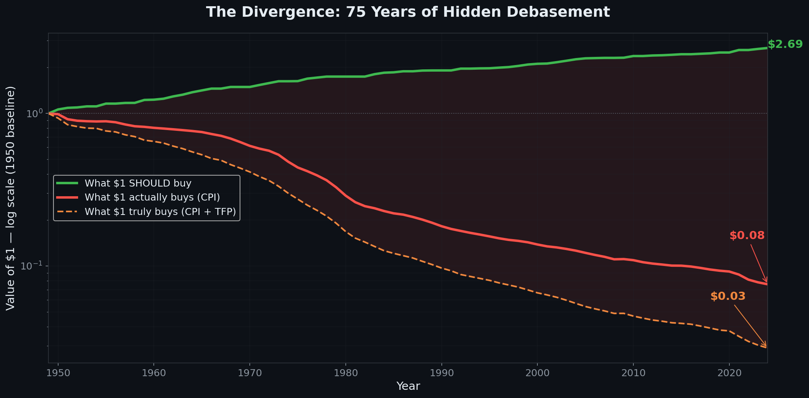

# The Missing Half of Inflation

*Standard inflation measures track prices that rose. They do not track prices that should have fallen but didn't. Adding foregone deflation roughly doubles the measured rate of purchasing power erosion.*

---

How much purchasing power does a dollar lose each year?

The Consumer Price Index says about 3.5%, averaged over the postwar era. That number is well-measured, transparently constructed, and correct on its own terms. But it may also be incomplete, in a way that compounds significantly over time.

The issue is not that the Bureau of Labor Statistics miscounts price increases. It is that price increases are only half the story. Every year, the economy becomes more productive. Workers produce more per hour. Factories extract more output from the same inputs. Software automates tasks that previously required weeks. Under a stable monetary regime, rising productivity would push prices *down*. A dollar would stretch further, not because wages rose, but because goods became cheaper to produce.

That deflation does not arrive. Its absence has a cost, one that does not appear in any standard inflation measure.

---

## A Thought Experiment, Then the Data

Consider an economy where the money supply holds steady and productivity grows at 2% per year. More goods chase the same number of dollars. Prices drift downward. A fixed paycheck purchases a little more each year, even if the number on it does not change. This is roughly what occurred in the United States between 1870 and 1900, a period examined in detail below.

Now consider the same economy, but the central bank expands the money supply to hit a 2% inflation target. Productivity is still growing at 2%, still reducing production costs. But instead of prices falling 2%, they rise 2%. The gap between where prices ended up and where productivity alone would have taken them is four percentage points, not two.

That gap is what economists in the "productivity norm" tradition call foregone deflation. It is the distance between the observed price level and the one a stable monetary regime would have produced. It can be quantified.

The quantity theory of money provides the framework. In its simplest form: if the money supply and velocity are stable, then when real output (Y) rises, the price level (P) must fall. The interesting question is how large the effect has been historically.

From FRED data spanning 1948 to 2024:

- **Average CPI inflation:** 3.53% per year
- **Average foregone deflation (total factor productivity):** ~1.08% per year
- **Average foregone deflation (labor productivity):** 2.15% per year

| Measure | CPI | + Foregone Deflation | = Total Purchasing Power Loss |
|---------|-----|---------------------|-------------------------------|
| Conservative (CPI + TFP) | 3.53% | ~1.08% | **~4.6%/yr** |
| Upper bound (CPI + labor productivity) | 3.53% | 2.15% | **5.68%/yr** |

Total factor productivity measures pure efficiency gains: how much additional output the economy extracts from the same basket of inputs. It is the theoretically cleaner measure, the one favored in the productivity norm literature developed by Selgin (1997) and Cachanosky (2014). Labor productivity runs higher because it captures capital deepening, meaning workers produce more partly because they have better tools. Both are defensible. Neither is perfect. The truth likely sits somewhere between them.

*Figure 1: True debasement vs. reported CPI, 1948–2024. Source: BLS (CPIAUCSL, OPHNFB) via FRED.*

An important clarification: this is not a claim that the BLS mismeasures inflation. CPI plus foregone deflation does not reveal hidden price increases the government missed. It measures a different quantity entirely: the total opportunity cost of an inflationary monetary regime, the gap between actual purchasing power and what purchasing power would have been under stable money. Whether that counterfactual is the right benchmark is a judgment call. The gap itself is a matter of data.

A formal model deriving this result from Cobb-Douglas production with heterogeneous money holdings (following Grandmont and Younès, 1973; Grandmont, 1983) is presented in the Appendix. The key result: when new money enters through asset markets rather than being distributed evenly, workers' real consumption falls even as aggregate output rises. The redistribution is an equilibrium property, not a friction.

---

## Cross-Validation

Several independent measures land in a similar range.

**Monetary aggregates.** M2 money supply has grown at roughly 7% per year since 1960. Real GDP grew at about 3%. The gap of approximately 4% represents monetary expansion beyond what real economic growth required. This is consistent with the foregone deflation estimate, arrived at from completely different data.

**Asset prices.** Denominating the S&P 500 in gold rather than dollars eliminates much of the post-1971 equity rally. What appears as extraordinary wealth creation in nominal terms looks more like assets keeping pace with monetary expansion. This does not prove the foregone deflation thesis, but it is consistent with it.

**The wage-productivity gap.** The persistent and well-documented wedge between productivity growth and median real compensation since the early 1970s is the household-level manifestation of foregone deflation. The model's Scenario 2 demonstrates how real gains can persist while becoming invisible under nominal illusion.

Different data, different methods, convergent results.

---

## Variation by Decade

The relationship between visible inflation and foregone deflation is not constant. It shifts across decades in a pattern that illuminates the framework.

| Decade | CPI | Productivity | Total Loss | Ratio to CPI |
|--------|-----|-------------|------------|--------------|
| 1950s | 2.07% | 2.77% | 4.83% | 2.3× |
| 1960s | 2.34% | 2.74% | 5.07% | 2.2× |
| 1970s | 7.09% | 1.94% | 9.03% | 1.3× |
| 1980s | 5.55% | 1.47% | 7.02% | 1.3× |
| 1990s | 3.01% | 2.09% | 5.10% | 1.7× |
| 2000s | 2.57% | 2.67% | 5.24% | 2.0× |
| 2010s | 1.77% | 1.26% | 3.03% | 1.7× |
| 2020s | 4.20% | 2.15% | 6.35% | 1.5× |

*Figure 2: Decade averages. Source: BLS (CPIAUCSL, OPHNFB) via FRED.*

The ratio column reveals a structural pattern. When headline inflation runs high (the 1970s, the 1980s), the foregone deflation component is a modest addition; CPI already captures most of the purchasing power loss. When headline inflation is low, the hidden component becomes proportionally larger. In the 1950s and 2000s, total purchasing power erosion ran at more than double the CPI figure.

This produces a measurement paradox: the more successfully the Federal Reserve suppresses observed inflation, the larger the share of purchasing power loss that goes unmeasured.

---

## Cumulative Impact

Small annual differences compound into large ones over decades.

Since 1950, at the reported CPI rate, a dollar's purchasing power fell to approximately **$0.08**. At the combined rate of roughly 5.3% per year, effective purchasing power falls to approximately **$0.03**.

Under a stable monetary regime with productivity gains flowing through as lower prices, that same dollar would have a purchasing power of approximately **$2.69** today. The ratio between these endpoints (roughly 35:1) represents the cumulative cost of seven decades of monetary expansion in an economy that was simultaneously becoming radically more productive.

*Figure 3: Purchasing power of $1 (1950 baseline). Source: BLS (CPIAUCSL, OPHNFB) via FRED.*

---

## Where the Productivity Dividend Went

If productivity kept rising but prices did not fall, the gains were allocated somewhere. The data indicates they split unevenly across three channels, and the distribution shifted over time.

| Period | Productivity Growth | Real Compensation Growth | Workers' Share |
|--------|-------------------|------------------------|----------------|
| 1948–1973 | 2.80%/yr | 2.63%/yr | **92%** |
| 1973–2000 | 1.70%/yr | 1.03%/yr | **55%** |
| 2000–2024 | 1.95%/yr | 0.84%/yr | **38%** |

*Figure 6: Productivity vs. real compensation, indexed to 1948. Source: BLS (OPHNFB, COMPRNFB) via FRED.*

During the Bretton Woods era, when the dollar was anchored to gold, workers captured the vast majority of productivity gains as rising real wages. After 1973, the link weakened. By the 2000s, less than two-fifths of productivity growth appeared in worker compensation. The remainder was absorbed by two forces: monetary expansion (which pushed up asset prices rather than lowering consumer prices) and a rising corporate profit share, which climbed from roughly 5% to 12% of GDP over the period.

*Figure 7: Labor share of national income, 1948–2024. Source: BEA (W270RE1A156NBEA) via FRED.*

*Figure 8: Corporate profits after tax as % of GDP, 1948–2024. Source: BEA (A4102E1A156NBEA) via FRED.*

The timing of this divergence is notable. The gap between productivity and compensation begins almost exactly when the gold standard ended in 1971. Globalization, deunionization, and technological change all contributed (the causes of the wage-productivity gap are among the most debated questions in economics). The monetary regime change remains the simplest explanation for the timing of the divergence.

---

## The Historical Precedent

This framework predicts that a period of monetary stability combined with rapid productivity growth should produce falling prices and rising living standards. The late nineteenth century provides a natural test.

Between 1870 and 1900, the United States operated on a gold standard that constrained monetary expansion while the Second Industrial Revolution (railroads, electrification, steel) drove substantial productivity gains. Prices fell at roughly 1.7% per year. From 1880 to 1896, the price level dropped 30% while real GDP rose 85%.

The conventional assumption is that deflation and economic distress are linked. Atkeson and Kehoe (2004), in an influential study for the Minneapolis Fed, examined the historical record across multiple countries and found no systematic link between deflation and depression outside the singular case of the 1930s. Productivity-driven deflation (prices falling because production costs decline) appears to operate through a fundamentally different mechanism than the debt-deflation spirals of the Great Depression.

---

## Addressing the Obvious Objections

**"Doesn't CPI already adjust for quality improvements?"** Partially. Hedonic adjustments cover about 30% of the CPI basket and account for quality changes in goods like computers and cars. But quality adjustment and production cost reduction are different phenomena. A laptop that is twice as fast at the same price receives a hedonic adjustment. A laptop that costs half as much to manufacture, but whose price remains flat because monetary expansion absorbs the savings, exemplifies the phenomenon under discussion. The overlap between hedonic adjustments and foregone deflation is estimated at 0.1 to 0.3 percentage points per year. It narrows the range. It does not close it.

**"Productivity gains don't have to become lower prices."** Correct. This is the most important caveat. In any real economy, productivity gains split among lower prices, higher wages, and higher profits (as Scenario 3 above illustrates). The framework here measures the total opportunity cost of the inflationary regime against a counterfactual of stable money. Whether that counterfactual is the right benchmark is a legitimate debate, separate from whether the arithmetic is sound.

**"Deflation would cause serious economic problems."** This is an argument about the *desirability* of the current monetary regime, not about its *cost*. Both propositions can hold simultaneously: inflationary policy may prevent painful debt-deflation spirals while also imposing a measurable purchasing power cost that standard metrics do not capture. Acknowledging the cost does not require opposing the policy.

---

## The Question Ahead: Artificial Intelligence

If this framework is correct, the relationship between productivity growth and monetary policy becomes more consequential as productivity accelerates. There is reason to expect acceleration.

If artificial intelligence delivers sustained productivity growth of 3–5% annually (a range consistent with optimistic but not extreme forecasts), maintaining a 2% inflation target would require enough monetary expansion to overcome that deflationary pressure and push prices up further. Applying equation (16), the total purchasing power cost would run between 5% and 7% per year, possibly higher.

*Figure 5: Log-scale divergence, 1950–2024. Source: BLS (CPIAUCSL, OPHNFB) via FRED.*

Under a neutral monetary policy, rapid AI-driven productivity growth would manifest as falling prices: the cost of goods and services declining as production becomes cheaper. Under an inflation-targeting regime, that same productivity growth requires proportionally larger monetary expansion, which the historical pattern suggests flows disproportionately into asset prices.

The faster the economy becomes at producing goods, the more money must be created to prevent prices from falling. Whether that tradeoff is worth making is one of the more consequential economic questions of the coming decade.

---

## Summing Up

The standard measure of inflation (roughly 3.5% annually over the postwar era) captures price increases that occurred. It does not capture price decreases that would have occurred under stable money but were absorbed by monetary expansion. Adding foregone deflation yields a total purchasing power erosion rate of approximately 4.6% to 5.7% per year, depending on the productivity measure used.

This is not a claim about statistical manipulation. It is a straightforward application of the quantity theory of money, consistent with a body of academic work on the "productivity norm," and corroborated by independent measures including monetary aggregate growth, asset price behavior, and the wage-productivity divergence. The Cobb-Douglas model above demonstrates that total purchasing power erosion equals the rate of monetary expansion, a result the M2 data confirms empirically.

Over short periods, the difference between 3.5% and 5% is barely perceptible. Over a career, it is the difference between a dollar retaining a third of its value and retaining a fifth. Over seventy-five years, the cumulative divergence spans a factor of roughly 35. The arithmetic operates identically whether it is tracked or not.

---

---

---

## Appendix: A Simple Model

The preceding variant used a cash-in-advance constraint to pin down the price level. This section presents the same result through a different monetary framework: Grandmont's temporary equilibrium approach (Grandmont and Younès, 1973; Grandmont, 1983). The production side is identical. What changes is how money enters the economy and, crucially, how its distribution across agents determines real outcomes. The Grandmont framework makes the distributional channel explicit from the start, rather than introducing it as a downstream consequence of monetary transmission.

### The Real Economy

The production side is unchanged. A representative firm produces a single final good using Cobb-Douglas technology:

$$Y = A \cdot K^{\alpha} \cdot L^{1-\alpha}, \quad \alpha = \frac{1}{3} \tag{1}$$

Factor supplies are fixed at $\bar{K} = 1$ and $\bar{L} = 1$. Competitive factor markets pay marginal products. By Euler's theorem, total factor payments exhaust output:

$$w \cdot \bar{L} + r \cdot \bar{K} = Y \tag{2}$$

Nothing here depends on the monetary framework. Output, factor shares, and real marginal products are determined entirely by technology and endowments.

### Money as Carried Balances

In the Grandmont framework, agents do not face a cash-in-advance constraint imposed from outside. Instead, they carry money balances from period to period. Money has value because it commands purchasing power over goods. The economy has two types of agents: workers, endowed with labor $\bar{L}$ and initial money holdings $m_W$, and capitalists, endowed with capital $\bar{K}$ and initial money holdings $m_K$. The total money stock is:

$$M = m_W + m_K \tag{3}$$

Each agent enters the period holding money acquired in the previous period. During the period, they sell their factor endowment to the firm at the prevailing nominal price, receive nominal factor income, and spend their total funds (initial money plus current income) on the final good. The firm collects revenue $p \cdot Y$ from goods sales and pays it out as nominal factor income: $w^{\text{nom}} \cdot \bar{L}$ to workers and $r^{\text{nom}} \cdot \bar{K}$ to capitalists.

The worker's total nominal expenditure is $m_W + w^{\text{nom}} \cdot \bar{L}$. The capitalist's total nominal expenditure is $m_K + r^{\text{nom}} \cdot \bar{K}$. Market clearing for the final good requires that total spending equals total revenue:

$$p \cdot Y = (m_W + w^{\text{nom}} \cdot \bar{L}) + (m_K + r^{\text{nom}} \cdot \bar{K}) \tag{4}$$

Since the firm pays out all revenue as factor income, $w^{\text{nom}} \cdot \bar{L} + r^{\text{nom}} \cdot \bar{K} = p \cdot Y$. Substituting into equation (4):

$$p \cdot Y = M + p \cdot Y \tag{5}$$

This cannot hold unless $M = 0$, which is unhelpful. The resolution is that agents do not spend all their income within the period. In temporary equilibrium, agents spend their carried balances plus some portion of current income, while retaining some money to carry forward. But for the simplest exposition that preserves the Grandmont insight, we can consolidate the circular flow: the firm receives $p \cdot Y$ in revenue, pays it to factor owners, and factor owners spend it along with their initial balances. Since the factor payments circulate back through the firm, the net money that must clear the goods market is just the stock of initial balances. In aggregate:

$$p \cdot Y = M \tag{6}$$

This looks identical to the cash-in-advance result. The aggregate price level is pinned down the same way. But the Grandmont framework adds something the aggregate equation hides: the distribution of $M$ across agents determines each agent's share of real consumption. This is the key difference.

### Each Agent's Real Consumption

Worker $i$'s real consumption depends on their share of total money holdings. Define $\sigma_i = m_i / M$ as agent $i$'s money share. In aggregate equilibrium, the worker's real consumption is:

$$c_W = \sigma_W \cdot Y = \frac{m_W}{M} \cdot Y \tag{7}$$

$$c_K = \sigma_K \cdot Y = \frac{m_K}{M} \cdot Y \tag{8}$$

Real consumption shares are determined by money shares. This is not a reduced-form assumption but a consequence of the equilibrium: each agent's purchasing power over goods equals their fraction of total money times total output. If the distribution of money changes, real consumption changes, even if aggregate output does not.

### Initial Equilibrium

Set $A = 1$, $M = 1$, with $m_W = 2/3$ and $m_K = 1/3$ (reflecting last period's income shares under $\alpha = 1/3$). Then:

$$Y = 1, \quad p = 1, \quad c_W = \frac{2}{3}, \quad c_K = \frac{1}{3} \tag{9}$$

Workers consume two-thirds of output, capitalists one-third. Money shares and consumption shares coincide.

### Scenario 1: Productivity Rises, Money Supply Fixed

Let $A$ increase to 1.02 with $M$ unchanged at 1 and money holdings unchanged ($m_W = 2/3$, $m_K = 1/3$).

$$Y_1 = 1.02, \quad p_1 = \frac{1}{1.02} \approx 0.9804 \tag{10}$$

Money shares are unchanged, so consumption shares are unchanged:

$$c_W = \frac{2/3}{1} \cdot 1.02 = 0.68, \quad c_K = \frac{1/3}{1} \cdot 1.02 = 0.34 \tag{11}$$

Both agents' real consumption rises by exactly 2%, matching the productivity gain. The mechanism is deflation: the same money buys more because goods are cheaper. The gains are symmetric across all money holders in proportion to their existing balances. No one's share changes.

### Scenario 2: Central Bank Targets 2% Inflation

Now suppose the central bank requires $p_1 = 1.02$. Output is still $Y_1 = 1.02$. The required money supply is:

$$M_1 = p_1 \cdot Y_1 = 1.02 \times 1.02 = 1.0404 \tag{12}$$

The central bank must inject $\Delta M = 0.0404$. The question that determines everything distributional is: who receives the new money?

Suppose the central bank conducts open market operations, purchasing bonds from capitalists. The new money holdings are:

$$m_W' = \frac{2}{3}, \quad m_K' = \frac{1}{3} + 0.0404 = 0.3737 \tag{13}$$

Now compute money shares under the new distribution:

$$\sigma_W' = \frac{2/3}{1.0404} = 0.6411, \quad \sigma_K' = \frac{0.3737}{1.0404} = 0.3592 \tag{14}$$

Compare these to the original shares: $\sigma_W = 2/3 \approx 0.6667$ and $\sigma_K = 1/3 \approx 0.3333$. The worker's share has fallen. The capitalist's share has risen. Real consumption follows:

$$c_W' = 0.6411 \times 1.02 = 0.6539, \quad c_K' = 0.3592 \times 1.02 = 0.3664 \tag{15}$$

The worker's real consumption rose from $0.6667$ to $0.6539$. That is not a gain. It is a loss of 1.9%. The capitalist's real consumption rose from $0.3333$ to $0.3664$, a gain of 9.9%. The entire 2% productivity dividend, and then some, has been redirected.

### The Distributional Identity

The Grandmont framework makes the redistribution visible as pure arithmetic. The change in agent $i$'s consumption share when new money $\Delta M$ goes entirely to agent $j \neq i$ is:

$$\Delta \sigma_i = \frac{m_i}{M + \Delta M} - \frac{m_i}{M} = -m_i \cdot \frac{\Delta M}{M(M + \Delta M)} < 0 \tag{16}$$

This is negative for every agent who does not receive new money. It does not depend on frictions, sequencing, or who spends first. It is a property of the equilibrium. The non-neutrality of money in Grandmont's framework is not a story about disequilibrium dynamics or sticky prices. It is a statement about how the distribution of nominal balances maps to the distribution of real consumption. When the central bank changes that distribution, it changes who gets what, even if aggregate output is unchanged.

### Connecting to the Data

The model's prediction aligns with the same empirical patterns noted in the main text. Under a fixed money regime (or one where monetary expansion is distributed proportionally), productivity gains flow symmetrically to all agents through lower prices. Under inflation targeting with asset-market transmission, the injection of new money through financial channels shifts money shares toward asset holders. The Grandmont framework clarifies that this is not merely a timing effect (first spenders versus last spenders) but a structural feature of any monetary equilibrium in which new money is distributed asymmetrically. The size of the transfer, $\Delta M / M \approx 3.9\%$ of initial GDP in the numerical example, matches the order of magnitude of observed seigniorage flows in modern economies with positive inflation targets and trend productivity growth. Auclert (2019) formalizes this intuition rigorously, identifying three distinct channels through which monetary policy redistributes: earnings heterogeneity, Fisher debt revaluation, and interest rate exposure. His central finding is that redistribution is not a side effect of monetary transmission but a mechanism of it, because the winners and losers of monetary expansion differ systematically in their marginal propensity to consume.

---

---

## Bibliography

Atkeson, A. and Kehoe, P.J. (2004). "Deflation and Depression: Is There an Empirical Link?" *American Economic Review*, 94(2), pp. 99–103. Also: Federal Reserve Bank of Minneapolis Staff Report 331.

Cachanosky, N. (2014). "Hayek's Rule, NGDP Targeting, and the Productivity Norm: Theory and Application." *Journal of Stock & Forex Trading*, 3(2).

Grandmont, J.-M. (1983). *Money and Value: A Reconsideration of Classical and Neoclassical Monetary Theories*. Econometric Society Monograph No. 5. Cambridge: Cambridge University Press.

Auclert, A. (2019). "Monetary Policy and the Redistribution Channel." *American Economic Review*, 109(6), pp. 2333–2367.

Grandmont, J.-M. and Younès, Y. (1973). "On the Efficiency of a Monetary Equilibrium." *Review of Economic Studies*, 40(2), pp. 149–165.

Hayek, F.A. (1931). *Prices and Production*. London: Routledge & Sons.

Selgin, G. (1997). *Less Than Zero: The Case for a Falling Price Level in a Growing Economy*. London: Institute of Economic Affairs. Reissued 2018, Washington: Cato Institute.

Sumner, S. (2021). *The Money Illusion: Market Monetarism, the Great Recession, and the Future of Monetary Policy*. Chicago: University of Chicago Press.

---

*Data: Bureau of Labor Statistics (OPHNFB, MFPNFBS, CPIAUCSL, COMPRNFB, W270RE1A156NBEA) via FRED, Federal Reserve Bank of St. Louis, 1948–2024.*
